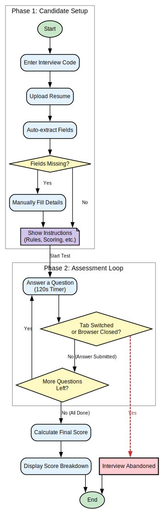
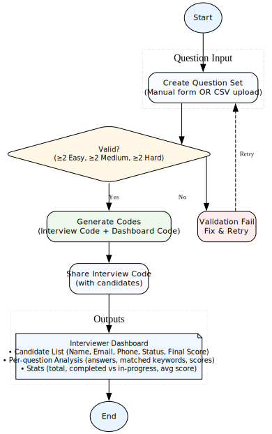
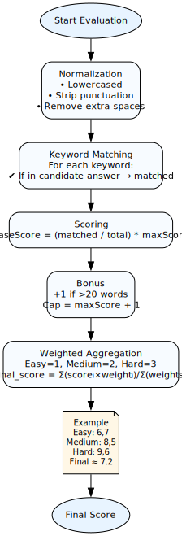

# SmartHire Interview Platform

An AI-powered interview assessment platform built with **React**, **Redux Toolkit**, **Node.js/Express**, and **Tailwind CSS**. It provides a **Candidate view** for taking timed interviews and an **Interviewer Dashboard** for managing question sets and monitoring candidate results.

This application uses **MongoDB** with **Mongoose** as its backend database, handling all data storage and functionalities. This ensures that data is persistent and accessible across different sessions and devices.

---

## 🚀 Features

### Candidate Flow



* **Enter Interview Code**: Candidate starts by entering the unique code provided by the interviewer.
* **Upload Resume**: Upload a resume in `.txt` or `.docx` format (≤ 5 MB).

  * Name, Email, and Phone auto-extracted using regex heuristics.
  * Missing fields can be filled manually.
* **View Instructions**: Clear instructions shown before starting (rules, scoring criteria, disqualification conditions).
* **Answer Questions**:

  * 6 questions (2 Easy, 2 Medium, 2 Hard).
  * Each question timed (default 120 seconds).
  * Switching tabs or closing browser marks interview as abandoned.
  * Empty answers or timeouts yield a score of 0.
* **Instant Feedback**: Immediate feedback after each answer.
* **Final Score**: Weighted score with performance breakdown shown at the end.

### Interviewer Flow



* **Create a Question Set**:

  * Manual entry via form.
  * Bulk CSV upload with format:

    ```csv
    difficulty,question,keywords,maxScore
    easy,"What is var, let, and const in JS?","var;let;const;scope;hoisting",10
    medium,"Explain JWT authentication.","jwt;authentication;token;header;payload",10
    hard,"Design a scalable file upload service.","scalable;file upload;cdn;storage;api gateway",15
    ```
  * Validation ensures at least 2 questions per difficulty level.
* **Code Generation**:

  * Generates unique Interview Code (candidates) and Dashboard Code (interviewer).
* **Share Code**: Interviewer shares Interview Code with candidates.
* **Monitor Dashboard**:

  * Candidate overview (Name, Email, Phone, Status, Final Score).
  * Detailed analysis of answers, matched keywords, and scores.
  * Aggregate statistics: total candidates, completion rate, average scores.

---

## ⚙️ Evaluation Logic



### Normalization

* Answers converted to lowercase.
* Punctuation stripped.
* Extra whitespace removed.

### Keyword Matching

* System checks for presence of predefined keywords.
* Each match is recorded.

### Scoring

```
baseScore = (matchedKeywords / totalKeywords) * maxScore
```

### Bonus

* +1 point if answer exceeds 20 words.
* Max score per question = `maxScore + 1`.

### Final Weighted Score

* Easy = weight 1
* Medium = weight 2
* Hard = weight 3

```
final_score = Σ(score_i × weight_i) / Σ(weights)
```

**Example:**

* Easy: 6, 7
* Medium: 8, 5
* Hard: 9, 6
* Final Score ≈ **7.2**

---

## 📂 Project Structure

```
ai-interview-assistant/
├── index.html               # Entry HTML
├── package.json             # Frontend dependencies
├── vite.config.js           # Vite config
├── tailwind.config.js       # Tailwind config
├── postcss.config.js
├── backend/
│   ├── package.json         # Backend dependencies
│   ├── server.js            # Express server entry point
│   ├── config/
│   │   └── db.js            # MongoDB connection
│   ├── models/
│   │   ├── Candidate.js     # Candidate schema
│   │   └── QuestionSet.js   # Question set schema
│   ├── controllers/
│   │   ├── candidateController.js
│   │   └── questionSetController.js
│   └── routes/
│       ├── candidateRoutes.js
│       └── questionSetRoutes.js
└── src/
    ├── App.jsx              # Main view controller
    ├── main.jsx             # React entry point
    ├── index.css            # Tailwind directives
    ├── components/          # UI Components
    │   ├── HomePage.jsx
    │   ├── CreateQuestions.jsx
    │   ├── CandidateFlow.jsx
    │   ├── ResumeUpload.jsx
    │   ├── InterviewInstructions.jsx
    │   ├── InterviewQuestion.jsx
    │   ├── QuestionFeedback.jsx
    │   ├── InterviewComplete.jsx
    │   └── InterviewerDashboard.jsx
    ├── store/
    │   ├── store.js         # Redux store config
    │   └── interviewSlice.js # State management
    └── utils/
        └── evaluation.js    # Evaluation + scoring logic
```

---

## 🛠️ Installation

Clone repository:

```bash
git clone <repo-url>
cd ai-interview-assistant
```

Install frontend dependencies:

```bash
npm install
```

Install backend dependencies:

```bash
cd backend
npm install
cd ..
```

---

## 🔧 Environment Setup

### Backend Environment

Create `.env` file in the `backend/` folder:

```env
MONGO_URI=your_mongodb_connection_string
PORT=5000
```

### Frontend Environment

Create `.env` file at project root:

```env
VITE_API_URL=http://localhost:5000/api
```

---

## ▶️ Run

### Start Backend Server

```bash
cd backend
npm run dev
```

The backend server will run on `http://localhost:5000`

### Start Frontend Development Server

In a new terminal, from the project root:

```bash
npm run dev
```

The frontend will run on `http://localhost:5173`

### Build for Production

Frontend:

```bash
npm run build
npm run preview
```

Backend:

```bash
cd backend
npm start
```

---

## 📊 State Management

* **Redux Toolkit** for central state management.
* **State**: Stores `questionSets`, `candidates`, `interviewSessions`.
* **Actions**: Async thunks like `createQuestionSetInDB`, `createCandidateInDB`, `submitAnswerInDB`, `updateCandidateOnCompletion`.
* **Persistence**: MongoDB stores all app data via Express REST API.
* Async thunks sync state with MongoDB backend.

---

## 🗄️ Backend Architecture

### Tech Stack
- **Node.js & Express**: RESTful API server
- **MongoDB & Mongoose**: Database and ODM
- **CORS**: Cross-origin resource sharing enabled

### API Endpoints

**Question Sets:**
- `POST /api/question-set` - Create new question set
- `GET /api/question-set/:code` - Get question set by interview code
- `GET /api/question-set/dashboard/:code` - Get dashboard data by dashboard code

**Candidates:**
- `POST /api/candidate` - Create new candidate
- `POST /api/candidate/answer` - Submit an answer
- `PUT /api/candidate/:id/complete` - Mark interview complete with final score
- `PUT /api/candidate/:id/status` - Update candidate status (e.g., abandoned)

---

## 📑 Security & Limitations

* File format: only `.txt` and `.docx` resumes supported.
* No PDF support (client parsing unreliable).
* Max file size: 5 MB.
* Data stored in MongoDB database.
* No authentication: interviewer dashboard accessible with Dashboard Code only.
* CORS enabled for local development.

---

## 🔮 Future Enhancements

* Server-side PDF resume parsing.
* Authentication + role-based access control.
* Candidate reports export (CSV, PDF).
* Real-time dashboard sync using WebSockets.
* AI-based semantic scoring (beyond keyword matching).
* Advanced interviewer analytics with visualization.
* Email notifications for candidates and interviewers.
* Multi-language support.

---

## 📝 Conclusion

The **AI Interview Assistant** streamlines the hiring process by automating candidate assessments, scoring, and monitoring. Its seamless **candidate flow** ensures a fair test environment, while the **interviewer dashboard** empowers recruiters with detailed insights and statistics. By leveraging **React**, **Redux Toolkit**, **Tailwind CSS**, **Node.js**, **Express**, and **MongoDB**, this project achieves a scalable, secure, and user-friendly solution for modern interview management.

This project can serve as a foundation for building more advanced **AI-driven recruitment systems**, integrating NLP, semantic analysis, and predictive analytics in future versions.

---

## 👨‍💻 Author

**Parimal Maity**  
AI & Full Stack Developer  
📧 Contact: [parimalmaity852@gmail.com](mailto:parimalmaity852@gmail.com)  
🔗 GitHub: [https://github.com/parimal-art](https://github.com/parimal-art)

---

> "The best way to predict the future is to create it." – Peter Drucker
